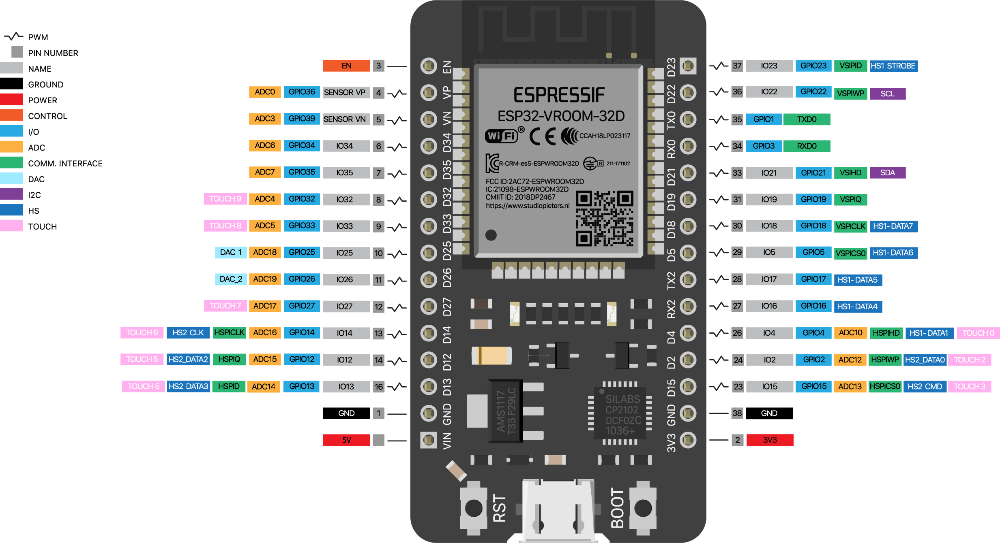

  
  <h1>👩‍🍳 ESP32 Cookbook 👨‍🍳</h1>

 

**Disclaimer:** This don't intend to be a guide of best practices. It is just a collection of small projects to learn how to use the esp32.
Do not take it too seriously.

### Basic ingredients.
- [ESP32](https://www.espressif.com/en/products/socs/esp32)
- micro usb cable
- VSCode with [platformIO](https://platformio.org/) or [ArduinoIDE](https://www.arduino.cc/en/software)

### Recipes.

